<div align="center">


<br/>


**A Retail/Mainline plugin for ElvUI — Midnight-ready, modular, and built for a cleaner UI.**

[](https://github.com/mBlinkii/mMediaTag)
[](https://www.curseforge.com/wow/addons/mmediatag)
[](https://discord.com/invite/AE9XebMU49)

</div>

---

`mMediaTag` adds a large collection of UI enhancements, custom media, utility datatexts, portrait styles, dock icons, tags, nameplate helpers, and quality-of-life tools on top of ElvUI.

This is the Midnight-ready branch of the addon and focuses on a cleaner structure, better performance, and a more modular setup.

## What It Adds

- Custom portrait styles for multiple unit frames with support for class icons, spec icons, extra overlays, shadows, custom textures, and per-unit placement.
- Dock-style datatext icons for common panels such as character, friends, guild, dungeon finder, spellbook, talents, professions, mail, quests, bags, achievements, calendar, volume, encounter journal, and more.
- Utility datatexts such as Mythic+ score, teleports, professions, game menu, dungeon info, combat time, durability and item level, coordinates, and tracking helpers.
- Custom ElvUI tags for classification, health, status, role, level, faction, quest state, PvP state, power, class icons, and death counters.
- Nameplate helpers including target glow color syncing, an execute-range marker, and highlight tools.
- Miscellaneous modules such as auto quest handling, auto role check acceptance, greeting messages, tooltip tweaks, minimap skins, data panel skins, Objective Tracker skinning, dice button, Details embedding, and LFG invite info.
- Built-in media libraries for icons, portrait textures, dock assets, minimap art, and additional UI visuals.

## Screenshots

<div align="center">

<table>
<tr>
<td align="center" width="50%">
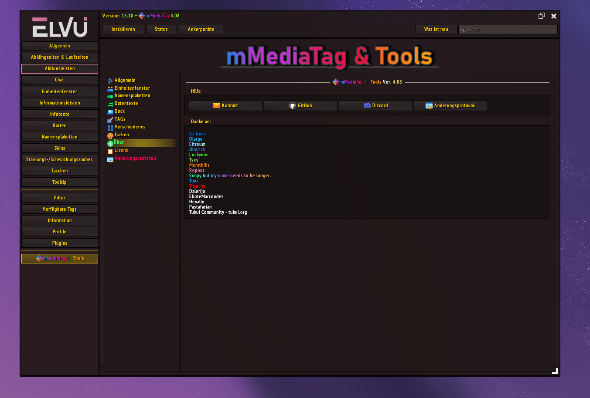<br/>
<sub>Options built directly into ElvUI</sub>
</td>
<td align="center" width="50%">
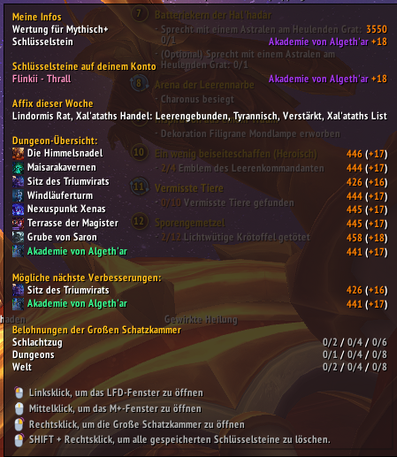<br/>
<sub>Mythic+ / Dungeon-Info datatext</sub>
</td>
</tr>
<tr>
<td align="center">
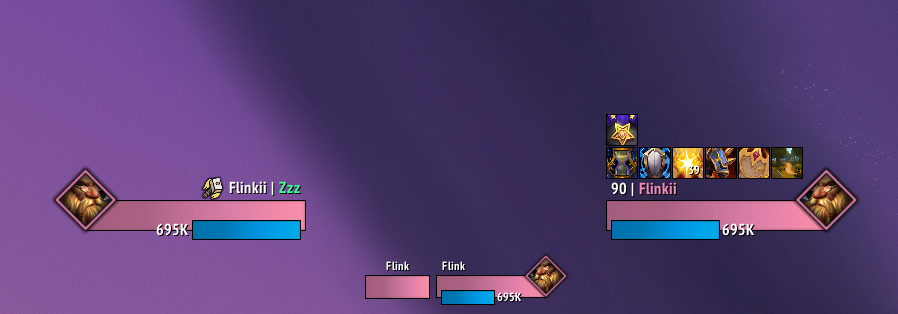<br/>
<sub>Player, target and party portraits with class icons</sub>
</td>
<td align="center">
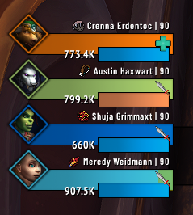<br/>
<sub>Party portraits with role icons</sub>
</td>
</tr>
<tr>
<td align="center">
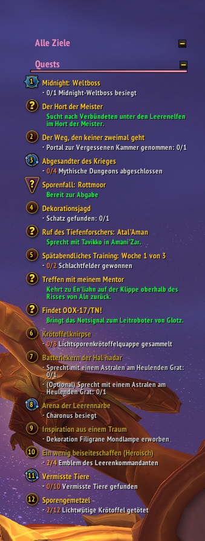<br/>
<sub>Skinned Objective Tracker</sub>
</td>
<td align="center">
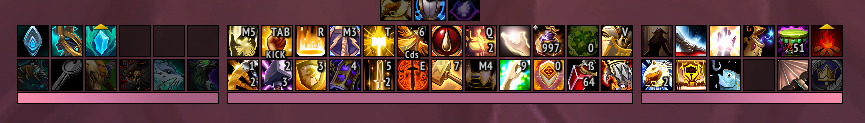<br/>
<sub>Nameplate highlighters and important casts</sub>
</td>
</tr>
<tr>
<td align="center">
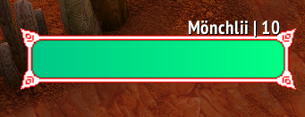<br/>
<sub>Nameplate castbar border styles</sub>
</td>
<td align="center">
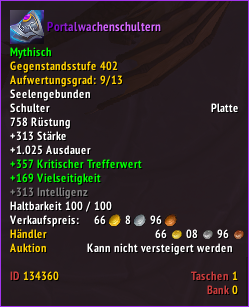<br/>
<sub>Tooltip styling</sub>
</td>
</tr>
</table>

**Dock icon styles** — pick the look that fits your UI:

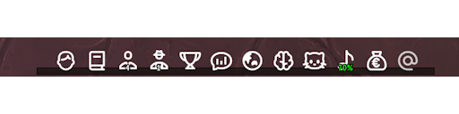
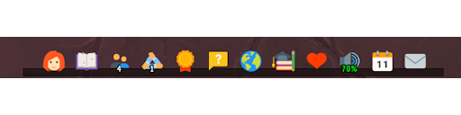
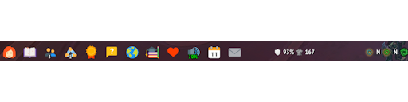
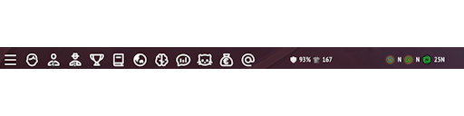
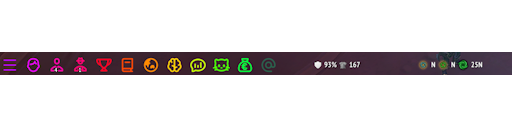

</div>

## Highlights

- Built directly into the ElvUI options UI under `ElvUI > mMT`
- Modular setup so you can enable only the parts you actually use
- Extensive portrait customization for modern ElvUI layouts
- Dock icons that work with ElvUI datatext bars, including custom dock setups
- Optional integration with `Details` and `ElvUI_JiberishIcons`
- Localization files for `deDE`, `enUS`, `esES`, `esMX`, `frFR`, `itIT`, `koKR`, `ptBR`, `ruRU`, `zhCN`, and `zhTW`

## Requirements

- World of Warcraft Retail / Mainline
- ElvUI

Optional integrations:

- `Details` for embedded Details-related features and class icon support
- `ElvUI_JiberishIcons` for additional icon integration when installed

## Installation

### CurseForge / Addon Manager

Install `mMediaTag` with your preferred addon manager and make sure `ElvUI` is already installed.

### Manual Installation

1. Download the latest packaged release.
2. Extract the addon folder.
3. Place `ElvUI_mMediaTag` inside your WoW addons directory:

```text
World of Warcraft\_retail_\Interface\AddOns\
```

4. Make sure the final folder name stays exactly `ElvUI_mMediaTag`.
5. Start the game and open `ElvUI > mMT`.

## Configuration

All addon settings are available in:

```text
ElvUI > mMT
```

Main sections include:

- `General`
- `Unitframes`
- `Nameplates`
- `Datatexts`
- `Dock`
- `TAGs`
- `Misc`
- `Colors`

If you want to build your own dock bar, create a custom ElvUI datatext bar and assign the `mMT` dock datatexts to its slots.

## Slash Commands

- `/mmt` opens the addon options
- `/mmt help` shows the command list
- `/mmt version` prints the current addon version
- `/mmt guid` prints your player GUID
- `/mmt clearunknownids` clears the saved unknown ID cache
- `/mmt adddev` adds the current character as a developer character
- `/mmt debug` toggles debug mode
- `/mmt debug safe` toggles debug mode with a reduced addon set

## Feature Overview

### Portraits

- Large bundled portrait texture library
- Support for player, target, targettarget, focus, pet, party, arena, and boss portraits
- Optional embellishments, shadows, extra textures, cast icons, and class/spec icon overlays
- Custom texture paths for users who want to extend the portrait system with their own assets

<div align="center">

</div>

### Dock System

- Icon-first datatext modules with hover growth, color states, text labels, and notification markers
- Secure button support for click actions and macros
- Ready-made modules for many common Blizzard and ElvUI destinations
- Flexible enough to assemble your own dock layout through ElvUI datatext bars

<div align="center">
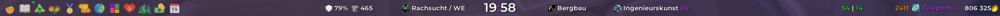
</div>

### Tags

- Classification tags for rare, elite, rare elite, and boss units
- Status tags for AFK, DND, offline, dead, and ghost states
- Role tags with text or icon output
- Health, level, power, faction, PvP, quest, and death count helpers
- Class icon tags with style-specific output

### Nameplates and Utility Modules

- Target glow color can automatically match your class color
- Execute Marker showing your spec's execute range on enemy nameplates
- Highlight modules for target, focus, and quest units
- Auto quest accept and turn-in with sensible restrictions
- Auto role check acceptance
- Details embedding into chat panel areas
- Objective Tracker skinning
- Custom minimap and panel skin options

<div align="center">
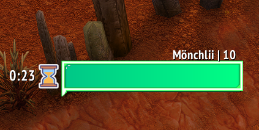

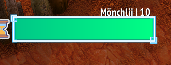
</div>

## Current Branch Notes

- The `4.x` branch targets Retail/Mainline.
- This branch is Midnight-focused and has been restructured heavily for the new version.
- According to the in-addon changelog, `4.x` is not intended to be the Classic branch.

## Support

- GitHub: [mBlinkii/mMediaTag](https://github.com/mBlinkii/mMediaTag)
- Discord: [discord.com/invite/AE9XebMU49](https://discord.com/invite/AE9XebMU49)

## License

This project uses a custom license. In short:

- Private modifications are allowed.
- Redistribution of the addon is not allowed.
- Redistribution of the textures is not allowed.
- The addon name and folder name must not be changed.

For the exact terms, see [LICENSE.md](LICENSE.md).
